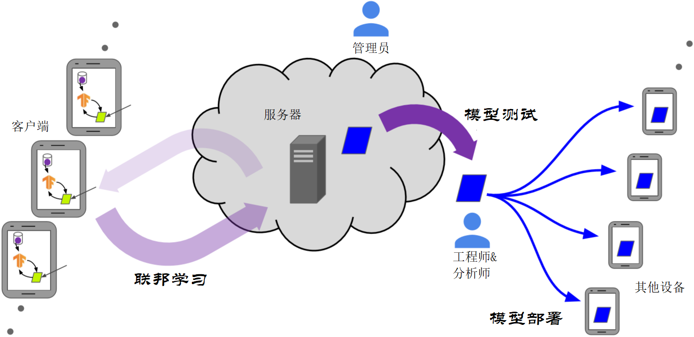

# 第4章 保护用户隐私数据

机器学习过程由许多功能不同的角色参与运作。例如，用户可以通过与设备交互来生成训练数据，在机器学习训练过程中，其从这些数据中提取人机交互模式（例如，以训练后模型参数的形式），之后机器学习工程师或分析师可以评估该训练模型的质量，最后可能将该模型部署在最终用户主机上，以支持定制的用户体验（见下图1）。

在一个理想的世界里，系统中的每一个参与者只会学到扮演他们角色所需的信息。例如，如果分析师只需要确定某个特定的质量度量是否超过了所需的阈值，以便授权将模型部署到最终用户，那么在理想化的世界中，该度量值是分析师可以获得的唯一信息；该分析师既不需要访问训练数据，也不需要访问模型参数。类似地，最终用户体验到的可能只需要由经过训练的模型提供的预测，而不需要其他任何内容。

此外，在理想的世界中，系统中的每个参与者都能够轻松、准确地推断出自己和他人的哪些个人信息可能通过参与系统而泄露，参与者将能够利用这一推理结果，就是否参与以及如何参与做出明智的选择。

创建一个具有上述所有理想隐私属性的系统本身将是一项令人望而生畏的壮举，若其还可以实现其他令人满意的属性，则更是难上加难，比如所有参与者的易用性、最终用户体验的质量和公平性（以及影响体验结果的模型），智能地使用通信和计算资源、抵御攻击和失败的能力等。

与其追求无法企及的完美，我们不如另辟蹊径——整个系统由模块化单元组成，这些单元可以相对独立地进行学习和改进，同时我们也要注意，我们最终必须根据上述我们的理想隐私目标，测量整个系统的隐私属性。本节中，我们将提出目前无论是通过单个模块实现方法还是通过整个系统实现方法，还不了解如何同时实现所有目标的领域，作为开放性研究问题。 

*图1 联邦学习模型的生命周期及联邦学习系统中的不同参与者（与第1章中的图相同）*

联邦学习提供了一个有吸引力的结构，可以将整个机器学习工作流程分解成我们想要的可实现的模块单元。联邦学习模型的一个主要优点是它可以通过数据最小化为参与的用户提供一定程度的隐私：设备从不发送原始用户数据，只将对模型的更新（例如梯度更新）发送到中央服务器。这些模型更新更侧重于要完成的学习任务而非关注原始数据（即，与原始数据相比，它们严格不包含关于用户的附加信息，而且通常不包含其他意义），并且单个更新只需要由服务器暂时保存。

虽然这些特性可以在集中所有训练数据的基础上提供显著的实用性隐私改进，但是在这个基线联邦学习模型中仍然没有隐私的正式保证。例如，可以构造这样的场景，在该场景中，原始数据的信息从客户端泄漏到服务器。比如，知道以前的模型和用户的梯度更新将允许某一方推断该用户持有的训练示例。因此，本节调查现有的结果，并概述了设计可以提供严格的隐私保障的联邦学习系统的开放性的挑战。我们更专注于联邦学习和分析设置中特定的问题，而不考虑了在一般的机器学习设置中也会出现的问题。

除了针对用户隐私的攻击之外，还有其他种类的对联邦学习的攻击；例如，对方可能会试图阻止模型被学习，或者他们可能会试图使模型产生偏向对方的训练结果。我们稍后在第5章讨论这些类型的攻击的讨论。

本章的其余小节梗概如下。第4.1节讨论了我们希望提供抵御的各种威胁模型。第4.2节列出了一套核心工具和技术，可用于针对第4.1节中讨论的威胁模型提供严格的保护。第4.3节假定可信服务器的存在，并讨论在对抗对手和/或分析师提供保护方面的公开问题和挑战。第4.4节讨论了在没有完全可信服务器的情况下的开放性问题和挑战。最后，第4.5节讨论了关于用户感知的开放性问题。

## 4.1 参与者，威胁模型与深层隐私 

在联邦学习中，对隐私风险的规范处理需要一种整体的、跨学科的方法。对于一些风险类型，可以通过将现有技术扩展到指定场景中从而保护隐私和减轻风险，而其他更复杂的风险类型则需要跨学科的协同努力。

隐私不是二进制量，甚至不是标量。这种规范处理的第一步是准确描述不同的参与者（见第1节图1，为方便起见，在第35页重复）及其在模型中扮演的角色，最终确定相关的威胁模型（见表7）。例如，我们希望将服务器管理员的视图与使用所学模型的分析师的视图区分开来，因为可以想象，设计用于针对恶意分析师提供强大隐私保证的系统可能不会提供任何恶意攻击的机会。这些参与者行为模式很好映射到其他文献中讨论的威胁模型上；例如，在Bittau等人中。[67，第3.1节]，“编码器”对应于客户机，“洗牌者”通常对应于服务器，“分析器”可能对应于服务器或分析师完成的后处理。

例如，一个特定的系统可能提供差异性的隐私保证（差异性隐私将在4.2.2节规范化介绍，这里知道更小的ε表示更强的隐私性即可），比如向服务器管理员提供的特定参数为ε，而分析师观察到的参数结果可能具有更高的保护性ε’<ε。

此外，这一保证可能仅适用于能力受到特定限制的对手，例如可以观察服务器上发生的所有事情（但不能影响服务器的行为）的对手，这类对手同时完全控制占客户端总数比例为γ的客户端（“完全控制”即可以观察他们可获知的所有数据并以任意方式影响其行为）；对手也可能被认为无法破解在特定安全级别σ下，实例化的加密机制。为了对抗实力突破这些限制的对手，在服务器管理员的看来可能仍然需要差异性隐私保证，但认为分析师观察的结果在较弱的隐私保护级别ε’>ε。

正如我们在本例中看到的，精确地指定系统的假设和隐私目标，以及诸如差异性隐私保证、老实但好奇行为等安全性概念，可以很容易地通过到几个参数（ε、ε’、ε0、γ、σ等）进行具体实例化。

实现联邦学习所需的所有隐私属性通常需要将下述的许多工具和技术组合到端到端系统中，包括以下两种：多种分层策略都是为了保护系统的同一部分（例如，在可信执行环境（TEE）中运行安全多方计算（MPC）协议的一部分，使对手更难对该组件产生足够大的损害）以及使用不同的策略来保护系统中不同的部分（例如，使用MPC保护模型更新的聚合，然后在服务器之外共享聚合更新之前使用隐私披露技术）。

因此，在两种技术都无法提供其预期隐私保护能力的情况下，我们提倡构建这样一种优美的联邦系统，即尽可能降低隐私性。例如，在TEE中运行MPC协议的服务器组件可能允许维护隐私，即使TEE安全性或MPC安全性假设中的一个（但不是两个）在实践中不成立。另一个例子是，要求客户端向服务器端TEE发送渐变更新，而要求客户端将原始训练示例发送到服务器端TEE将被强烈不推荐。因为一旦TEE的安全性失效，前者的隐私性期望将更优美地降级。我们将这种优美降级的原则称为“深度隐私”，类似于成熟的深度防御网络安全原则[311]。 

## 4.2 工具与技术

一般来说，联邦学习计算的目的是让分析师或工程师通过计算请求获得结果，这可以看作是对分布式客户机数据集上的函数*f*的评估（通常是机器学习模型训练算法，但可能更简单，例如基本的数据统计）。有三个隐私方面需要解决。

首先，我们需要考虑*f*是如何计算的，以及在这个过程中中间结果的信息流是什么，它主要影响对恶意客户端、服务器和管理参与者的敏感性。除了设计系统中的信息流（例如提前数据最小化）外，包括安全多方计算（MPC）和可信执行环境（TEEs）等安全计算相关技术对于解决这些问题特别重要。这些技术将在第4.2.1节中详细讨论。

其次，我们必须考虑该计算哪些内容。换言之，*f*本身的计算结果会向分析师和域内参与者透露了参与客户的多少信息。这与隐私保护披露技术，特别是差异隐私（DP）是高度相关的，将在第4.2.2节中详细讨论。

最后，可验证性也是需要考虑的问题，即客户机或服务器能够向系统中的其他人证明他们已忠实地运行了所需的指令，而不泄露他们运行过程中的潜在隐私数据。验证技术，包括远程认证和零知识证明，将在第4.2.3节中讨论。

### 4.2.1 安全计算

安全计算的目标是评估计算分散输入的函数，通过判断其是否仅向预期各方显示计算结果，而不显示任何附加信息（例如各方的输入或任何中间结果）。

**安全多方计算：**安全多方计算（MPC）是密码学的一个子领域，与这样一个问题有关：一组参与方计算其隐私输入通过共识函数得到输出，从而可以只向每个参与方显示期望的输出。这一领域在20世纪80年代由姚[422]开创。由于理论和工程上的突破，该领域已经从单纯的理论研究转向工业上的部署技术[71、70、257、29、169、209、210]。值得注意的是，MPC定义了一组技术，应该更多地被视为安全计算中的领域或安全性的一般概念，而不是技术本身。MPC的一些最新进展可以归因于低级原语的突破，例如不经意传输协议[211]和具有同态性质的加密方案（如下所述）。

​                                                           *表4-1 不同的敌对参与者的多种威胁模型*

| **数据/访问节点** | **参与者**                                           | **威胁模型**                                                 |
| --------------------- | ---------------------------------------------------- | ------------------------------------------------------------ |
| 客户端                | 通过系统设计或破坏设备获得客户端设备的最高访问权限者 | 恶意客户端可以检查所参与轮次从服务器接收的全部消息（包括模型迭代），并可以篡改训练过程。老实但好奇的客户端可以检查从服务器接收的所有消息，但不能篡改培训过程。在某些情况下，安全包围/TEEs等技术可能会限制此类攻击者的影响和信息可见性，从而削弱该模型威胁程度。 |
| 服务器                | 通过系统设计或破坏设备获得服务器设备的最高访问权限者 | 恶意服务器可以检查所有轮次发送到服务器的全部消息（包括梯度更新），并可以篡改训练过程。老实但好奇的客户端可以检查发送到服务器的所有消息，但不能篡改培训过程。在某些情况下，安全包围/TEEs等技术可能会限制此类攻击者的影响和信息可见性，从而削弱该模型威胁程度。 |
| 输出模型              | 工程师与分析师                                       | 恶意分析师或模型工程师可以访问系统的多组输出，例如，使用不同超参数的多个训练运行的模型迭代序列。该向这类参与者发布什么信息是一个重要的系统设计问题。 |
| 部署模型              | 其他设备                                             | 在跨设备联邦学习场景下，最终模型可能部署到数亿个设备上。访问部分受损的设备可能仍满足黑盒模型，而访问完全受损的设备可以认为是白盒模型。 |

密码学解决方案的共同点是，操作通常在一个有限的字段上完成（即，素数*p*都是整数），这在表示实数时会带来困难。一种常见的方法是调整机器学习模型及其训练程序，即通过标准量化操作并依赖精心设计的量化模式，以确保下（上）溢量在可控范围[172、14、182、77]。

即使在恶意对手面前，任何函数都可以安全计算[183]这一点在几十年间达成了共识。虽然通用解决方案存在，但它们的性能特征常常使它们在实际设置中不适用。因此，研究显著趋势是线性和逻辑斯蒂回归[309，172，302]和神经网络训练和推理[302，14，46]等应用设计定制协议。这些协议通常在孤井互通的设置中进行，或是将计算委托给一组不相互协作的计算服务器的变体模型。将这些协议移植到跨设备设置并不简单，因为它们需要大量的通信。

*同态加密*          同态加密（Homomorphic encryption）方案允许在密文上直接执行某些数学运算，而无需事先解密。同态加密通过使参与者计算函数值，同时保持值隐藏，是一个使MPC成为可能的强大工具。

从一般的全同态加密（FHE）〔176〕到更高水平的变体[79, 160, 80，112 ]，同态加密存在多种实现[3, 350, 4 ]。一些称为部分同态的方案同样具有实际意义，例如包括ElGamal和Paillier，允许同态加法或乘法。加性同态加密称为孤井互通设置中MPC协议的一种成分[309 198]。文献[345]调研了一些同态加密软件库，并简要说明了选择库时应考虑的标准/特性。

​                                            *表4-2 不同技术及其特性描述*

| **技术**                                     | **特性描述**                                                 |
| -------------------------------------------- | ------------------------------------------------------------ |
| 差异隐私（本地、中心、混编、聚合、混合模型） | 从包含用户的数据集的输出分析中可以了解到的个人信息量。具有差分隐私的算法必然包含一定数量的随机性或噪声，可以对其进行调整以掩盖用户对输出的影响。 |
| 安全多方计算                                 | 两个或多个参与者协作，通过密码学模拟完全可信的第三方，第三方满足：   •计算所有参与者提供的输入的函数；   •向选定的部分参与者显示计算结果，同时任一方没有进一步学习。 |
| 同态加密                                     | 允许一方在不具有纯文本访问权限的情况下，不解密密文下对密文执行数学运算，从而计算出它们的数据的函数。尽管计算成本更高，任意复杂度的数据函数都可以通过这种方式计算（“完全同态加密”）。 |
| 可信执行环境（安全环境）                     | 可信执行环境提供了在远程计算机上可靠地运行代码的能力，即使不信任计算机的所有者/管理员。这是通过限制任何一方（包括管理员）的能力来实现的。尤其是，可信执行环境具有以下性质373]：   •一致性：除非程序显式发布消息，否则程序的执行状态始终不可见；   •完整性：除非程序显式接收输入，否则程序的执行不会受到影响；   •可测量/认证性：可信执行环境可以向远程方证明什么程序（二进制）正在执行，以及它的起始状态是什么，定义了一致性和完整性的初始条件。 |

考虑在联邦学习设置中使用同态加密，会遇到谁该持有该模式的密钥这一问题。虽然每个客户机加密其数据并将其发送到服务器端进行同态计算的想法很有吸引力，但服务器不应该能够解密单个客户机的提交数据。克服这一问题的一个简单方法是依赖一个持有密钥并解密计算结果的外部非合谋方。然而，大多数同态加密方案要求密钥经常更新（例如，由于易受选择密文攻击[102]）。此外，使用信任的非共谋方不在标准的联邦学习设置中。

解决此问题的另一种方法是依赖于分布式（或阈值）加密方案，其中密钥在各方之间分发。Reyzin等人。[336]和Roth等人。[341]提出在跨设备设置中计算总和的这种解决方案。他们的协议使用了加性同态方案（分别是基于ElGamal和基于格的方案的变体）。

**可信执行环境：**可信执行环境（TEEs，也称为安全环境）可以将联邦学习过程的一部分转移到云中的可信环境中，而该环境的代码可以被证明和验证。可信执行环境拥有几个关键性质，使他人相信，一段程序已被忠实而保密地执行[373]：

• 一致性：除非程序明确发布消息，否则程序的执行状态仍是保密的。

• 完整性：除非程序显式地接收输入，否则程序的执行不会受到影响。

• 可测量/认证性：可信执行环境可以向远程方证明什么程序（二进制）正在执行，以及它的起始状态是什么，定义了一致性和完整性的初始条件。

可信执行环境已经在实现不同体系结构上被，包括英特尔的SGX处理器[208，116]、ARM的TrustZone[2，1]和Sanctumon RISC-V[117]，它们在上述关键性质上的性能各不相同。

当前的安全环境在内存方面受到限制，只提供对CPU资源的访问，即它们不允许在GPU或机器学习处理器上进行处理（Tram`er和Boneh[382]探索如何将可信执行环境与GPU结合起来进行机器学习推断）。此外，对于可信执行环境（特别是那些在共享微处理器上操作的可信执行环境）来说，完全排除所有类型的侧信道攻击也是一项挑战[391]。

虽然安全环境为运行在其中的所有程序提供保护，但在实践中还必须解决其他问题。例如，通常有必要将运行在该环境中的代码构造为一个不受数据影响的过程，这样它的运行时和内存访问模式就不会显示它正在计算的数据的信息（参见示例[67]）。此外，可测量/证明性通常只证明某个特定的二进制文件正在运行；系统架构师需要提供一种方法来证明该二进制文件具有所需的隐私属性，这可能需要使用来自开源代码的复现过程来重构该二进制文件。

如何在安全环境、云计算资源和客户端设备之间划分联邦学习功能仍然是一个悬而未决的问题。例如，安全环境可以执行安全聚合或混编等关键功能，以限制服务器对原始客户端上传内容的访问，同时此可信计算基础不涉及大多数联合学习逻辑。

**受关注的安全计算问题**：虽然安全多方计算和可信执行环境为分布式隐私数据上的任何函数的保密计算问题提供了一般解决方案，但许多优化可以应用到某些特定功能中。下面描述的任务就是这种情况。

*安全聚合*        安全聚合是指在*n*个客户端和一个服务器的场景中，允许每个客户端提交一个值（通常是联邦学习设置中的向量或张量），这样服务器只学习客户端值的一个聚合函数，通常是这些值的和。

大量文献对单服务器设置（通过成对加法遮蔽[12，188，73]、通过阈值同态加密[356，193，92]、通过一般安全多方计算[86]）以及在多个非合谋服务器设置[71，29，113]中的安全聚合进行了探讨。也可以使用可信执行环境（如上所述）来实现安全聚合，如[269]。

*安全混编*        安全混编是指在*n*个客户端和服务器的场景中，允许每个客户机提交一条或多条消息，这样服务器只从所有客户端学习一个无序的消息集合（multiset），而不需要更多。具体来说，除了消息本身包含的信息之外，服务器无法判断任一条消息的发送者。安全混编可以被视为安全聚合的一个实例，其中值是多集单例，聚合操作为多集求和，尽管通常情况下，为达到安全混编和安全聚合的最佳性能，典型操作制度提供了非常不同的实现

在安全多方计算的背景下，安全混编通常是在混合网络的标题下进行研究[95 251]，也有在可信计算的背景下进行的研究[67]。混合网络中已经存在了以Tor网络[138]的形式进行的大规模部署。

*隐私信息检索*        隐私信息检索（PIR）是服务器为客户端提供的功能。它使客户机能够从服务器托管的数据库中下载条目，这样服务器就不会获得客户机请求的条目的任何信息。

MPC方法将PIR分为两大类：基于计算的PIR（cPIR），其中一方可以执行协议的整个服务器端[249]；基于信息论的PIR（itPIR），需要其中多个非共谋方执行协议的服务器端[106]。

PIR适用性的主要障碍如下：cPIR具有非常高的计算成本[361]，而非共谋方设置难以在工业场景中有说服力地实现。最近关于PIR的研究结果表明，通过使用基于点阵的密码系统，计算成本显著降低[16，313，17，25，175]。[218]已经证明了在单个服务器上如何利用用户可用的边带信息构建高效通信PIR。最近的相关工作建议利用客户机本地状态来加速PIR。帕特尔等人[319]展示了如何获取后者边带信息，并在单个服务器上实现和验证了一个实用的混合（基于计算和信息论）PIR方案。Corrigan-Gibbs和Kogan[114]在一个离线/在线模型上提出了一种压线性的在线PIR协议，在该模型的离线阶段，客户端从服务器获取信息，这些请求独立于将来要执行的查询。

过去的工作[410]，进一步探索了PIR和隐私共享之间的联系，最近[139]将编码数据联系到PIR中，并且已经建立了高效通信PIR[66]。PIR也在开-关隐私的背景下进行了研究，在这种背景下，客户可以关闭他们的隐私保护以换取更好的实用性或性能[306, 423]。

### 4.2.2 隐私保护披露

量化和限制个人信息披露的最新模型是差异隐私（DP）[147，144，145]，其目的是在发布的模型中引入一定程度的不确定性，以充分掩盖任何个人用户的贡献。差异隐私由隐私损失参数(*ε*,*δ*)量化，其中较小的(*ε*,*δ*)对应于隐私性增强。更正式地说，对于所有*S*⊆Range(*A*)，以及所有相邻数据集*D*和*D’*，如果满足下式，则称随机化算法*A*是(*ε*,*δ*)-差异隐私的：

*P*(*A*(*D*) ∈*S*) ≤ *e**ε**P*(*A*(*D’*) ∈*S*) + *δ*. (3)

在联邦学习的情景中，*D*和*D’*对应于分散的数据集，如果*D’*可以通过加上或减去单个客户机（用户）的所有记录而从*D*获得，则这些数据集是相邻的[290]。这种差异隐私的概念被称为用户级差异隐私。它比通常使用的相邻概念强，其中*D*和*D’*只相差一条记录[145]，因为通常一个用户可以向数据集贡献多条记录（例如训练集）。

在过去的十年中，用于差异性私有数据分析的广泛技术已经得到发展，特别是在假设集中设置的情况下，在应用实现隐私所需的扰动之前，原始数据由可信方收集。在联邦学习中，通常编排服务器将充当DP机制的可信实现者，确保只将私有化的输出发布给模型工程师或分析师。

然而，在可能的情况下，我们通常希望减少对可信方的需求。近年来，人们考虑了几种减少对数据管理员信任需求的方法。

**本地差异隐私**       通过让每个客户机在与服务器共享数据之前对其数据进行差异隐私转换，可以在不需要可信集中服务器的情况下实现差异隐私。也就是说，我们将公式（3）应用于处理单个用户的本地数据集*D*的机制*A*，并且保证对任何可能的其他本地数据集*D’*保持相同的性质。该模型被称为本地差异隐私模型（LDP）[406，229]。LDP已经被谷歌、苹果和微软有效地用于收集大型用户群中热门项目的统计数据[156，135，136]。它还被Snap[325]用于垃圾邮件分类训练的联邦设置中。这些LDP部署都涉及大量的客户机和表项，在Snap中甚至高达10亿，这与DP的集中实例化形成鲜明对比，而后者可以从更小的数据集中提供高实用性。不幸的是，正如我们将在第4.4.2节中讨论的那样，在保持效用的同时实现LDP是很困难的[229，388]。因此，需要一个介于完全中心和完全本地DP之间的差分隐私模型。这可以通过分布式差异隐私或混合模型来实现，如下所述。

**分布式差异隐私**   为了在不依赖可信的中心服务器的情况下恢复中心DP的一些实用性，可以使用分布式差分隐私模型[146、356、67、105]。在此模型下，客户机首先计算并编码一个最小（特定应用程序）的报告，然后将编码后的报告通过安全计算函数，该功能的输出可供中央服务器访问，从而在服务器能够检查时，此输出已经满足了不同的隐私要求。编码是为了帮助维护客户端的隐私，可以包括如LDP等隐私项。安全计算功能可以有多种体现。它可以是一个MPC协议，一个在TEE上完成的标准计算，甚至是两者的结合。每种选择都有不同的假设和威胁模型。

必须指出的是，分布式差异隐私和本地差异隐私从多个角度得到了不同的保证：虽然分布式DP框架可以为与LDP相同级别的差异隐私生成更准确的统计数据，但它依赖于不同的设置，并且通常会做出更有力的假设，例如作为对MPC协议的访问。下面，我们概述了两种可能的分布式差异隐私方法，依赖于安全聚合和安全混编，尽管我们强调还有许多其他方法可以使用。

通过安全聚合实现分布式DP。在第4.2.1节中讨论过，在FL中，安全聚合是实现分布式DP的一种的工具。安全聚合可用于确保中心服务器获得聚合结果，同时确保单个设备和参与者的中间参数不会透露给中心服务器。为了进一步确保聚合结果不会向服务器显示附加信息，我们可以使用本地差异隐私（例如，中等*ε*级别）。例如，每个设备可以在安全聚合之前扰动其自身的模型参数，以实现本地差异隐私。通过正确设计噪声，我们可以确保聚合结果中的噪声与可信服务器（例如，低*ε*/高隐私级别）集中添加的噪声匹配[12，330，181，356，188]。

通过安全混编实现分布DP。另一个分布式差异隐私模型是混编模型，它由最近引入的混编分析编码（ESA）框架[67]启动（如图3所示）。在这个框架的最简单版本中，每个客户端在其数据上运行一个LDP协议（例如，具有中等级的*ε*），并将其输出提供给一个安全的混编器。混编器随机排列报告表项，并将混编后报告的集合（没有任何标识信息）发送到服务器进行最终分析。直观地说，此安全计算功能的介入使得服务器更难了解参与者的任何信息，并支持差异隐私分析（例如，低*ε*/高隐私级别）。在更一般的多消息混编框架中，每个用户可以向混编器发送多个消息。混编器独立于服务器并专门用于混编，可以直接作为一个受信任的实体实现，也可以通过上面讨论的更复杂的加密原语来实现。

Bittau等人 [67]提议采用Prochlo系统作为实施ESA框架的一种方式。该系统采用整体隐私方法，考虑到安全计算方面（使用TEEs解决）、隐私披露方面（通过差异隐私解决）和验证方面（使用安全环境弱化认证功能）。

更普遍地说，差异隐私的混编模型可以使用更广泛的局部随机者类，甚至可以自适应地选择这些局部随机者[157]。这可以使差异私有协议的错误远远小于本地模型中可能的错误，同时依赖于弱于中心模型的信任假设[105、157、43、179、178]。

**混合差分隐私** 另一个可行的方法是混合差分隐私[39]，它通过根据用户的信任模型偏好（例如对管理员信任与否）来划分用户，从而组合多个信任模型。在混合模型之前，有两种选择。第一种是使用最不可信的模型，它通常提供最低的效用，并且保守地将其统一应用于整个用户群。第二种方法是使用最信任的模型，它通常提供最高的实用程序，但只应用于最信任管理者的用户。通过允许多个模型共存，混合模型机制可以从给定的用户基础获得更多的效用，与纯本地或中心DP机制相比。例如，[39]描述了一个系统，其中大多数用户在本地隐私模型中贡献他们的数据，而一小部分用户选择在可信的管理员模型中贡献他们的数据。这使得能够设计一种机制，在某些情况下，该机制的性能优于应用于所有用户的保守的本地机制以及仅应用于小部分选择参加用户的可信管理员机制。这种结构可以直接应用于联邦学习环境中；然而，组合信任模型或计算模型的一般概念也可能激发类似新的联邦学习方法。

​                                                 *图3  包含四个参与者的混编分析编码（ESA）框架* 

### 4.2.3 可验证性

与上述隐私技术正交的一个重要概念是验证性。一般来说，可验证的计算将使一方能够向另一方证明其已忠实地对其数据执行了所需的行为，而不会损害数据的潜在保密性。可验证计算的概念可追溯到Babai等人 [40]，并且已经在文献中的不同术语下进行了研究：检验[40]、认证计算[295]、委托计算[185]以及可验证性计算[173]。

在FL的背景下，验证能力可用于两个目的。首先，它将使服务器能够向客户机证明它忠实地执行了预期的行为（例如，聚合输入、显示输入消息或添加用于差异隐私的噪声）。其次，它将使客户端能够向服务器证明其输入和行为遵循协议规范（例如，输入属于某个范围，或者数据是正确生成的密文）。

多种技术可用于提供验证：零知识证明（ZKPs）、可信执行环境（TEEs）或远程认证。其中ZKPs提供了基于数学硬度的形式化密码安全保证，而其他技术则依赖于可信硬件的安全性假设。

**零知识证明（ZKPs）** 零知识证明是一种密码原语，它使一方（称为证明者）能够向另一方（称为验证者）声明证明，而验证者依赖于见证者已知的秘密信息，而不向验证者泄露这些信息。20世纪80年代末，Goldwasser等人引入了零知识（ZK）的概念[184]。它为隐私数据的可验证性问题提供了解决方案。虽然ZK构建方面存在大量的工作，但第一个将ZKP和通用功能的可验证计算引入实用领域的是Parnoetal的工作 [317]，它介绍了第一个针对简洁ZK的优化构建和实现。现在，ZKP协议可以实现100字节的证明大小和毫秒级的验证，无论被证明语句的大小。

ZKP有三个显著的属性：完整性（如果陈述是真的，证明者和验证者遵循协议，验证者将接受证明）、可靠性（如果陈述是假的，验证者遵循协议，验证者将拒绝证明）和零知识（如果陈述是真的，证明者遵循协议协议中，验证者只会了解到声明是真实的，不会从交互中了解到任何隐私信息）。

除了这些共性之外，在证明支持的语言、设置要求、证明和验证计算效率、交互性、简洁性和潜在的硬度假设方面，还有不同类型的零知识结构。有许多ZK结构支持特定的语句类，Schnorr证明[349]和Sigma协议[128]就是这样广泛使用的协议的例子。虽然此类协议在特定设置中有许多用途，但是能够支持任何功能的通用ZK系统提供了一个更广泛适用的工具（包括在FL的上下文中），因此我们将在接下来的讨论中重点讨论此类构造。

不同构造之间的一个主要区别是需要可信设置。一些ZKP依赖于一个公共引用字符串（common reference string，CRS），该字符串使用应该保持y隐私性来计算，以保证证明的可靠性。这种CRS的计算被称为可信设置。虽然这种要求对于这样的系统是不利的，但是现有的能够实现最简洁的证明和验证者有效性的ZKP，都需要可信的设置。

影响不同情况下适用性的另一个重要特性是，生成证明是否需要证明者和验证者之间的交互，这里我们区分非交互零知识证明（NIZK），该证明使验证者能够向验证者发送一条消息，且无需进一步通信。通常，我们可以将交互式的证明转换为非交互式的证明，从而对理想哈希函数的功能做出更有力的假设（即哈希函数生成结果完全随机）。

此外，对ZKP系统的有效性有不同的测量，如证明的长度和证明者、验证者的计算复杂度。从评估执行时间来说，理想的证明者的复杂性应该是线性的，但许多现有的ZKPS引入额外的（有时产生重大影响）证明者，产生更多开销。最有效的验证者复杂度要求在估计的功能的输入的大小上至少是线性的，并且在FL服务器的工作场景下的设置中，这个输入规模将是巨大的。

简洁的非交互式零知识证明（SNARKs）[65]是一种ZKP类型，它提供恒定的证明和验证大小，与输入大小成线性关系。这些有吸引力的性能是以更强的假设为代价的，而这一假设在大多数现有的方案中都是固有而可信的。大多数现有SNARK结构利用二次算术程序〔174, 317, 118〕，现在可在开源库中使用，如LiSnAgAg[[ 5 ] ]，并部署在加密货币场景中，如Zcash（57）。值得注意的是，SNARK系统通常需要证明者部分的开销；特别是，证明者的计算需要与被证明语句的大小上满足超线性关系。最近，谢等人〔418〕提出了一种ZKP系统，该系统能够实现线性证明者的复杂度，但增加了证明空间开销和验证时间。

如果我们放松对构造的简洁性或非交互性的要求，就会有大量广泛的效率权衡的构造实现，避免可信设置要求，并使用更标准的加密假设[84、397、23、58]。

近年来，越来越多的实际应用使用非交互式零知识证明，主要是由区块链驱动的。在FL中有效地使用交互式ZKP系统和NIZKs仍然是一个具有挑战性的开放性问题。在这种设置中，NIZKs可以向服务器证明客户机的输入。在验证者是客户端的情况下，创建一个可信的语句来验证将是一个挑战，因为它涉及到来自其他客户的输入。在这种情况下，最近的工作[76]使我们能够处理多个验证者共享陈述语句的情况。

**可信执行环境和远程认证**  我们在第4.2.1节中讨论了TEEs，但这部分的重点是TEEs提供可验证计算的可能。实际上，TEEs能够证明和验证在其环境中运行的代码（二进制）。特别是，当验证者知道（或可以复制）哪个二进制文件应该在安全环境中运行时，TEEs将能够提供完整性（除了输入之外，代码执行不会受到影响）和可证明性（TEE可以证明特定二进制文件正在执行，并且什么是启动状态）[373,385]。一般来说，远程认证允许验证者安全地测量远程硬件平台的内部状态，并可用于建立静态或动态信任源。虽然TEEs支持基于硬件的远程认证，但文献中提出了基于软件的远程认证[351]和混合远程认证设计[152,238]，并能够权衡硬件要求与可验证性。

在联邦学习环境中，TEEs和远程认证对于客户端能够有效地验证服务器上运行的关键功能可能特别有用。例如，安全聚合或混编可以在TEEs中运行，并为它们的输出提供不同的隐私保证。因此，服务器随后对差异隐私数据应用的后处理逻辑可以在服务器上运行，并且对客户端保持不敏感。注意，这样的系统设计要求客户端知道并信任要在安全环境中应用的关键函数的确切代码（二进制）。此外，远程证明可以使服务器证明FL计算中涉及的客户端的特定要求，例如无泄漏、不变性和不可中断性（关于远程证明的最低要求的详细列表，请参阅[166]。

## 4.3 防范外部恶意参与者 

在本节中，我们假设可信服务器的存在，并讨论实现对外部恶意参与者（例如敌对客户、敌对分析者、消耗学习模型的敌对设备或其任意组合）的严格隐私保证的各种挑战和公开问题。

如表7所述，恶意客户端可以在其参与的轮次中检查从服务器接收的所有消息（包括模型迭代），恶意分析师可以使用不同的超参数检查来自多个训练运行的模型迭代序列，在跨设备FL中，恶意设备可以通过白盒或黑盒访问最终模型。因此，要提供严格的保护以防范外部对手，首先必须考虑从中间迭代和最终模型中可以学到什么。

### 4.3.1 评估迭代轮次和最终模型 

为了更好地理解从中间迭代或最终模型中可以学到什么，我们建议量化联邦学习模型对特定攻击的易感性。在联邦学习环境中，这是一个特别有趣的问题。一方面，敌方从服务器接收到对模型的直接访问，拓宽了攻击面。另一方面，服务器确定对手将在训练过程的哪个特定阶段获得对模型的访问，并在每个阶段控制对手对模型的影响。

对于经典的（非联邦的）计算模型，了解模型对攻击的敏感性是一个活跃而富有挑战性的研究领域[167,357,91,293]。最常用的易于攻击量化模型方法是使用代理（评估）数据集模拟对模型的攻击，该数据集与实际中预期的数据集类似。如果代理数据集确实与最终用户数据相似，那么这就说明了模型的预期攻击敏感性。更安全的方法是确定模型攻击敏感性的最坏情况上限。 [425]在理论上给出了可接近的界限，尽管这一上界在实际模型中通常松散、空洞而无法达到。经验方法也许能够提供更严格的界限，但对于许多类型的攻击和模型，这一努力可能是棘手的。这一领域中一个有趣的新兴研究领域考察了理论条件（关于评估模型和攻击），即在何种条件下，通过模拟失败隐私侵犯的失败攻击，就意味着没有更强的攻击能够成功完成这样的任务[134]。然而，这一领域仍处于初级阶段，需要做更多的工作来更好地理解评估（通过模拟攻击）的基本要求。

联邦学习框架不仅为攻击提供了独特的设置，而且也为攻击数量和防御提供了独特的设置。具体来说，由于服务器可以控制每个用户在培训过程中何时可以访问和影响模型，因此可以设计新的可处理方法来量化模型的平均情况或最坏情况下的攻击敏感性。这样的方法将使得能够开发新的自适应防御，它可以应用于即时运行过程中，从而在最大化效用的前提下，面对不可抗拒的敌方时取得优先权。

### 4.3.2 考虑中心差异隐私的模型训练

为了限制或消除从迭代（和/或最终模型）中可以了解到的关于用户的信息，可以在FL的迭代训练过程中使用用户级差异隐私[72,90,288,62]。使用这种技术，服务器通过剪裁单次更新的*l*2范数结果，聚合被剪裁的更新，然后将高斯噪声添加到聚合结果中。这样可以确保迭代不会过拟合任何单个用户的更新。为了跨回合跟踪总体隐私预测，可以使用更高级的组合理论[148,221]或在[72, 97,299,405]中提出的分析动量统计方法。动量统计方法特别适用于均匀亚采样高斯机制。

在跨设备FL中，训练示例的数量在不同设备之间可能有很大的差异。因此，与中心模型[24]中关于用户级DP的最新工作类似，研究如何自适应地限制用户的贡献并剪裁模型参数仍然是一个有趣的研究方向[381,324]。更广泛地说，与记录级DP不同，在记录级DP中，各种规范学习和估计任务的准确性和隐私性之间的基本权衡关系很好理解，用户级DP从根本上来说就不那么容易理解（尤其是当贡献的数量在用户之间变化很大，并且没有先验的严格限制时）。因此，需要做更多的工作，以更好地理解在这种新出现的DP环境中的基本权衡。

除上述内容外，还必须区分在训练期间可能看到（某些）中间迭代的恶意客户端和只能看到最终模型的恶意分析师（或部署设备）。尽管中心DP提供了对两种威胁模型的保护，但仔细的理论分析可以发现，对于上述高斯机制（或任何其他差异隐私机制）的具体实现，我们可能会得到这两种威胁模型的不同隐私参数。当然，对于恶意分析师，我们应该获得比恶意客户更强的差异隐私保证（因为恶意客户可能比恶意分析师获得更多的信息）。费尔德曼等人最近对这种“通过迭代进行隐私放大”的设置进行了凸优化问题研究[163]。然而，还不清楚[163]中的结果是否可以被迁移到非凸设置。

**非均匀设备采样隐私放大程序**  跨设备FL的基本更新步骤在可用客户端的子集上进行。当所选择的用户子集从用户的基本群体中均匀抽样时，可以使用在[405]中开发的动量统计方法来分析该抽样过程的隐私增益。然而，这样的抽样程序在实践中几乎是不可能的。这是因为（a）服务提供商可能不知道设备的总体情况，并且（b）可用设备的特定子集可能会随时间而显著变化。因此，量化跨设备FL中的隐私放大是一个有趣的开放问题。

**随机源（改编自[288]）**  大多数计算设备只能访问很少的熵源，而且它们的速率往往很低（硬件中断、车载传感器）。使用熵为加密安全的伪随机数生成器（PRNG）种子并根据需要使用PRNG的输出是标准要求，这在理论上也是合理的。基于标准密码原语的鲁棒高效PRNG存在，在现代CPU上具有每秒千兆字节的输出速率，并且要求种子短于128比特[343 ]。

只要识别器在计算上有界，访问PRNG的随机算法*A*的输出分布与访问真实熵源的随机算法*A*的输出分布是不可区分的。相比之下，无论对手有多强大，差异隐私的保障对任何对手都是有效的。因此，几乎所有差异隐私的实现都只满足[298]引入的计算差异隐私的（变体）。从积极的方面来说，一个计算能力有限的对手无法分辨出两者的区别，这使得我们避免在这一点上过于局限。

一个训练过程可能有多个非确定性来源（例如，退出层或生成模型的输入），但只有那些反映在隐私目次中的来源必须来自加密安全的PRNG。特别是，设备采样过程和加高斯噪声必须从加密安全的PRNG中提取，以满足计算差异隐私。

**评估差异隐私实现**  众所周知，隐私和安全协议很难正确实现（例如，[296, 192]用于区分隐私）。什么技术可以用来测试FL实现的正确性？由于这些技术通常由那些可能选择不使用开源代码的组织部署，黑盒测试的可能性有多大？一些著作[137，275]开始在差异隐私的背景下探索这一领域，但仍有许多悬而未决的问题。

### 4.3.3 迭代隐蔽

在典型的联邦学习系统中，模型迭代（即每轮训练后模型的更新版本）被假定为对系统中的多个参与者可见，包括选择参与该轮的服务器和客户端。但是，可以使用第4.2节中的工具来对这些参与者隐藏迭代模型。

为了向客户端隐藏迭代，每个客户端都可以在提供保密特性的TEE中运行其联邦学习的本地部分（参见第4.2.1节）。服务器将验证预期的联邦学习代码是否在TEE中运行（依赖于TEE的认证和完整性功能），然后将加密的模型迭代结果传输到设备，以便它只能在TEE中解密。最后，模型更新将在返回到服务器之前在TEE内部加密，使用仅在安全环境内部和服务器上已知的密钥。不幸的是，TEE通常不适用于客户端，尤其是当这些客户端是智能手机等终端用户设备时。此外，即使存在TEE，它们也可能不够强大，无法支持训练计算，为了保护模型迭代，必须在TEE内部进行训练计算，并且可能需要高计算成本和/或大量的RAM。尽管TEE的能力可能会随着时间的推移而提高，以及诸如在[382]中所述的技术可以通过将计算的部分转移到TEE之外而减少对TEE的要求，同时保持计算的整体的证明、完整性和机密性需求。

在MPC模型下也可以实现类似的保护[302，14]。例如，服务器可以在将迭代器的模型参数发送到客户端之前，使用只有服务器知道的密钥在同态加密方案下对其进行加密。然后，客户端可以使用密码系统的同态属性计算加密的模型更新，而无需解密模型参数。然后，可以将加密的模型更新返回到服务器进行聚合。这里的一个关键挑战是在解密之前在服务器上强制聚合，否则服务器可能会学习到客户端的模型更新。另一个具有挑战性的开放性问题是提高性能，因为即使是最先进的系统也需要相当可观的计算资源才能在深层神经网络中完成一轮训练。这方面的进展既可以通过算法的进步，也可以通过为MPC开发更高效的硬件加速器来实现[337]。

向服务器隐藏模型迭代也会产生额外的挑战。在TEE模型下，联邦学习的服务器部分可以在TEE中运行，所有各方（即客户端和分析师）都验证服务器TEE仅在满足适当的培训标准后才发布最终模型。在MPC模型下，加密密钥可以保护模型迭代，密钥由分析师持有，在客户端之间共享，或由可信的第三方持有；在这种设置中，密钥持有者将被要求参与模型参数的解密，从而可以确保此过程只发生一次。

### 4.3.4 对不断变化数据的重复分析 

对于联邦学习的许多应用，分析师希望分析流式数据，并且还必须提供动态更新的学习模型，这些模型（1）对目前接受到的数据结果正确，以及（2）准确预测未来将要到达的数据。在没有隐私问题的情况下，分析师可以在新数据到达后简单地重新训练所学模型，以确保在任何时候都能达到最大的精度。然而，隐私保证等级随着关于相同数据的附加信息的发布而降低[147, 148]，这些附加信息引起更新的频率必须降低以保持整体分析的隐私性和准确性。

动态数据库和时间序列数据的差异隐私[125, 124, 89]研究的最新进展都假设存在可信的管理员，他们可以在上线时看到原始数据，并发布动态更新的统计数据。一个悬而未决的问题是，如何将这些算法技术扩展到联邦设置，以实现对时间序列数据或其他动态演变数据库的私有联邦学习。

具体开放性问题包括：

* 分析师应如何在有新数据的情况下更新私有FL模型？或者，在数据集*D*上使用FL私下学习的模型扩展到数据集*D’*（在给定的相似性度量中保证与*D*相似）的程度如何？由于FL已经出现在在线到达的样本上，并且没有过拟合它所用来训练的数据，因此这种模型很可能仍然会在新的数据集*D’*上表现良好。这也与第5节探讨的鲁棒性问题有关。
* 解决隐私构成问题的一种方法是生成可以独立使用，而不会造成额外隐私损失的合成数据[145，9]。这来自于差异隐私的后处理保证[147]。奥根斯坦等人在[32]中探索证明了以联邦方式生成合成数据。在动态数据设置中，合成数据可以重复使用，直到它相对于新数据变得“过时”，并且必须更新。即使在以联邦方式生成数据之后，它也必须以私有和联邦方式进行更新。
* 之前关于动态数据库差异隐私的工作[124]或不公开地检测时间序列数据变化[125, 89]中的具体方法是否可以扩展到联邦设置？
* 如何在联邦模型中首先查询时间序列数据？在设计上，同一个用户不会被多次定期查询更新的数据点，因此很难在评估过程中内收集到真实的个人数据随时间变化的估计值。在这里，可以使用时间序列数据统计抽样的常用工具，但必须与隐私工具和联合工具一起使用。其他方法包括重新格式化查询，以便评估查询中的每个子查询都可以在设备上完全应答。

### 4.3.5 防止模型被盗或误用

在某些情况下，开发ML模型的参与者或组织可能有动机来限制检查、误用或窃取模型的能力。例如，限制对模型参数的访问可能会使对手更难搜索漏洞，例如产生意外模型输出的输入。

如第4.3.3节所述，在推断下保护已部署的模型与在训练期间向客户端隐藏模型迭代的挑战密切相关。同样，可以使用TEEs和MPC方法。在TEE模型下，模型参数只能由设备上的TEE访问，如第4.3.3节所述；主要区别在于，所需的计算现在是推断而不是训练。

如果不放弃设备推理所提供的优点，就很难使MPC策略适应这个用例：如果用户数据、模型参数和推理结果原来都是在设备上进行的，则不清楚还有哪些其他方参与了多方计算。例如，朴素地试图使用同态加密将要求解密密钥位于要使用推断功能的设备上，从而首先破坏加密的价值。要求分析师参与的解决方案（例如，持有加密密钥或模型参数本身）意味着对最终用户的额外推理延迟、带宽成本和连接要求（例如，对于处于飞行模式的设备，推理将不再可用）。

必须注意的是，即使模型参数本身被成功隐藏；研究表明，在许多情况下，它们可以由对手重建，而对手只需访问基于这些参数的推理/预测API[384]。对于驻留在数百万或数十亿最终用户设备上的模型，需要采取哪些附加保护措施来防止此类问题，这是一个悬而未决的问题。

## 4.4 针对敌意服务器的保护 

在前面的章节中，我们假设存在一个可以编排整个训练过程的受信服务器。本节，我们讨论一种针对一个有敌意服务器的更合适的场景。特别是，我们首先调查这种环境和现有工作的挑战，然后继续描述未解决的问题以及如何使用第4.2节中讨论的技术来应对这些挑战。

### 4.4.1 信道，女巫攻击，选取 

在跨设备FL设置中，我们拥有一台具有大量计算资源的服务器和大量客户端，这些客户端（i）仅能与该服务器通信（如在星形网络拓扑中），并且（ii）连通性和带宽可能受到限制。 在执行给定的信任模型时，这提出了非常具体的要求。 特别是，客户端没有独立于服务器的清晰方法来在客户端之间建立安全通道。 如Reyzin等人所示。 [336]对于实际设置，在需要客户端之间专用通道的情况下，需要假设服务器在密钥分发阶段（如[73]中所做的）是诚实的（或至少是半诚实的）行为。 这包括基于MPC技术的密码解决方案。 对此假设的替代方法是将额外的参与方或公共公告板（例如，参见[341]）合并到客户端已知且可以信任的不与服务器串通的模型中。

除了信任服务器以促进专用通信渠道之外，跨设备FL的参与者还必须信任服务器以公平，诚实的方式形成客户群。控制服务器的主动恶意攻击者可能会模拟大量伪造的客户端设备（“ Sybil攻击” [140]），或者可能会从可用设备池中优先选择以前受到破坏的设备。无论采用哪种方式，对手都可以在联邦学习的一轮中控制更多的参与者，这要比简单地从总体中的对手设备的基本速率所预期的要多。这将使打破MPC中至少有一部分设备是诚实的普遍假设变得容易得多，从而破坏了协议的安全性。即使协议本身的安全性保持不变（例如，如果其安全性植根于不同的信任源，例如安全的隔离区），也可能存在以下风险：如果已知大量敌对客户端的模型更新，或由对手控制该更新，则可能会破坏其余客户的更新的隐私。注意，这些顾虑也可以适用于TEE。例如，基于TEE的混洗器也可能遭受Sybil攻击；如果将单个诚实用户的输入与来自假用户的已知输入进行混洗，那么对手将很容易在混洗输出中识别出诚实用户的价值。

请注意，在某些情况下，有可能在一轮客户端之间建立证明它们都在执行正确的协议，例如，如果客户端设备上有安全的隔离区，并且客户端之间可以进行远程证明。 在这些情况下，有可能为该回合中所有诚实的参与者建立隐私（例如，通过证明已正确遵循安全的多方计算协议，秘密且正确地添加了分布式差异隐私贡献等），即使 模型更新本身是对手已知的或由对手控制的。

### 4.4.1 现有方案的缺陷

鉴于FL的目标是服务器在客户数据中构建人口级别模式的模型，自然而然的隐私目标是量化并可证明地限制服务器重建单个客户输入数据的能力。这涉及形式上的定义（a）作为FL执行结果显示给服务器的客户数据的视图是什么，以及（b）这种视图的隐私泄漏是什么。在FL中，我们特别希望保证服务器可以汇总来自客户端的报告，同时以某种方式掩盖每个单独客户端的贡献。如第4.2.2节所述，这可以通过多种方式完成，通常使用一些差异性隐私的概念。这种方法有很多种，每种方法都有其自身的弱点，尤其是在FL中。例如，如已经讨论的，中央DP遭受对可信任中央服务器的访问的需求。这引出了第4.2.2节中讨论的其他有前途的私人披露方法。在这里，我们概述了这些方法的一些缺点。

本地差分隐私（LDP）

如前所述，LDP通过让每个客户端在将报告发送到中央服务器之前对其报告执行不同的私有转换，从而消除了对受信任的中央服务器的需求。 LDP假定用户的隐私完全来自该用户自己的随机性；因此，用户的隐私保证独立于所有其他用户添加的额外随机性。尽管LDP协议有效地加强了隐私并具有理论上的依据[156，135，136]，但许多结果表明，在保持实用性的同时实现局部差分隐私尤其具有挑战性，特别是在高维数据设置中[229，388， 219，51，220，424，142，111]。造成这种困难的部分原因是，引入的随机噪声的幅度必须与数据中信号的幅度相当，这可能需要合并客户端之间的报告。因此，要获得与中央设置相当的LDP效用，就需要相对较大的用户群或较大的参数选择。

混合差分隐私（HDP）

差异隐私的混合模型可以通过根据用户的信任首选项对用户进行划分来帮助减少所需用户群的大小，但是它不能为用户本地添加的噪声提供隐私放大功能。 而且，尚不清楚哪个应用领域和算法可以最佳地利用混合信任模型数据[39]。 混合模型的当前工作通常假设，无论用户信任偏好如何，其数据都来自相同的分布[39、141、53]。 放宽此假设对于FL尤其重要，因为信任首选项和实际用户数据之间的关系可能并不重要。

随机混合模型

随机混合模型可从用户的本地噪声中放大隐私，尽管它有两个缺点。首先是可信中介的要求；如果用户已经不信任管理员，那么他们不太可能会信任由管理员批准或创建的中介人（尽管TEE可能有助于弥合这一差距）。 Prochlo框架[67]（据我们所知）是唯一现有的实例。第二个缺点是随机混合模型的差异性隐私保证与参与计算的对手用户数量成比例地降低[43]。由于用户或管理员不知道该数字，因此将不确定性引入了用户所接收的真实隐私级别。在联合学习的情况下，这种风险尤其重要，因为用户（可能是对抗性的）是计算管道中的关键组成部分。当用户在本地添加自己的噪声时，安全的多方计算除了会给每个用户增加大量的计算和通信开销外，也无法解决此风险。

安全集聚协议

[73]中的安全聚合协议在聚合客户报告时具有强大的隐私保证。 此外，该协议是针对联合学习的设置而量身定制的。 例如，它对于客户端在执行过程中退出（跨设备FL的一个共同特征）是健壮的，并且可以扩展到大量参与者和更长的的向量。 但是，这种方法有几个局限性：（a）假定服务器为半诚实的服务器（仅在私钥基础结构阶段），（b）允许服务器查看全方位的聚合（可能仍会泄漏信息）， （c）稀疏向量聚合效率不高；（d）缺乏强制客户输入格式正确的能力。 如何构建一个有效，强大的安全聚合协议来解决所有这些挑战是一个悬而未决的问题。

### 4.4.2 分布式差分隐私训练

如果没有受信任的服务器，则可以使用分布式差异隐私（在第4.2.2节中介绍）来保护参与者的隐私。

分布式差分隐私下的通信，隐私和准确性权衡

我们指出，在分布式差异隐私中，三个性能指标是普遍关注的：准确性，隐私和通信，并且一个重要的目标是确定这些参数之间可能的折衷。 我们注意到，在没有隐私要求的情况下，关于分布估计（例如[376]）和通信复杂性的文献已经很好地研究了通信和准确性之间的权衡（有关教科书的参考，请参见[248]） 。 另一方面，在假设所有用户数据都由一个实体保存并且因此不需要进行通信的集中式设置中，从[147，146]的基础性工作开始，就已经在中央DP中广泛研究了准确性和隐私之间的权衡取舍。 

安全混合的折衷选择

最近在混合模型中研究了这些折衷，以解决聚合的两个基本任务（目标是计算用户输入的总和）和频率估算（输入属于离散集，目标是 估算拥有给定元素的用户数）。 有关这两个问题的最新发展情况，请参见表9和表10。 两个值得注意的开放问题是（i）在改组模型中研究纯差异隐私，以及（ii）在多消息设置中确定变量选择的最佳的私密性，准确性和通信折衷情况（在最近[178]提到的单消息情况下紧紧贴合的下限）

安全集聚协议的折衷选择

研究以下类似问题以进行安全聚合将非常有意思。假设一轮有n个用户参与的联邦学习，同时假设每个用户i持有数据$x_i$。用户i对$x_i$采用算法$A(.)$来获得$y_i = A(x_i)$;在这里，$A(.)$可以被视为压缩方案和私有化方案。通过使用安全集聚协议作为黑盒，服务提供商可以观察$\overline y = \Sigma_i A(x_i)$同时可以通过计算$\hat{\overline x} = g(\overline y)$来使用$\overline{y}$估计$x_i$的真实总值$\overline{x}$。理想情况下，我们希望以最小化x估计误差的方式设计$A(.),g(.)$;形式上，我们想解决最优化问题$min_{g,A} ||g(\Sigma_i A(x_i)) - \Sigma_i x_i||$,此处$||.||$可以是$l_1$范数或者$l_2$范数。当然，在不对$g(.)$和$A(.)$施加任何约束的情况下，我们始终可以选择它们作为恒等函数，并获得0错误。然而，$A(.)$需要满足两个约束：（1）$A(.)$应该输出B位(可以认为是每个用户的通信成本),同时（2）$\overline y = \Sigma_i A(x_i)$应当是$\overline x = \Sigma_i x_i$的$(\varepsilon, \delta)-DP$版本。因此，关注的基本问题是确定在聚合时也能实现DP且同时满足固定通信预算的最优算法$A$。换个角度看问题，对于固定的$n,B,\varepsilon,\delta$,我们希望实现的最小的$l_1$或$l_2 $误差是多少？我们注意到Agarwal等人的最新工作[13]提供了一种基于均匀量化和二项式噪声相加的候选算法A。但是，尚不清楚所提出的方法是否是在这种情况下的最佳方法。因此，在上述约束下得出$l_1 $或$l_2$误差的下限是非常重要的。

隐私账户？隐私登录？

在DP的中心模型中，经常使用欠采样的高斯机制来实现DP，并且使用==矩值会计==方法在FL的各轮之间紧密跟踪隐私预算（请参见第4.3节中的讨论）。 但是，在DP的分布式设置中，由于与安全混合和安全聚合的实际实现相关的有限精度问题，因此无法使用高斯机制。 因此，该空间中的现有工作已恢复为具有离散性质的噪声分布（例如，添加伯努利噪声或二项式噪声）。 尽管这样的分布有助于解决由安全混合/聚合的基础实现所施加的有限精度约束，但它们自然不会从==矩数会计==方法中受益。 因此，一个重要的开放问题是推导针对这些分布式DP考虑的离散（和有限支持）噪声分布量身定制的==隐私权计费==技术。

处理用户掉线问题

上面的分布式DP模型假设参与的客户端在一轮中保持与服务器的连接。 但是，当大规模运行时，某些客户端会由于网络连接断开或暂时不可用而退出。 这要求分布式噪声生成机制要针对此类遗漏具有鲁棒性，并且还要影响扩张联邦学习的规模和对大量参与客户端的分析。

就健壮的分布式噪声而言，客户端退出可能会导致添加的噪声太少，无法满足差分隐私epsilon目标。 保守的方法是增加每个客户端的噪音，以便即使使用最少数量的客户端才能满足差分隐私epsilon目标，以使服务器完成安全聚合并计算总和。 但是，当更多的客户报告时，这会导致过多的噪音，这引发了一个问题，即是否有可能提供更有效的解决方案。

在扩展方面，增加参与安全聚合回合的客户端数量时，丢失的客户端数量将成为瓶颈。 同时收集足够的客户也可能是一个挑战。 为此，可以对协议进行结构化，以便客户端可以在长时间运行的聚合回合过程中多次连接，以完成其任务。 更普遍的，还有在文献中尚未系统地解决当客户可能间歇性可用时的大规模操作的问题。

新的可信赖的模型

联合学习框架利用联合学习的独特计算模型，并可能在对抗性用户的能力上做出现实的假设，从而推动了比以前使用的模型更加精细的新信任模型的开发。例如，假设多少比例的客户可能会受到对手的损害？攻击者是否有可能同时攻击服务器和大量设备，或者通常假设攻击者只能攻击一个或另一个设备就足够了吗？在联合学习中，服务器通常由众所周知的实体（例如长期存在的组织）操作。可否利用它来建立一个信任模型，在该模型中，服务器的行为是可信的但经过验证的，即，其中不会阻止服务器偏离所需协议，但是如果服务器确实偏离了协议，则很有可能被检测到（从而破坏信任，声誉，以及托管组织的潜在财务或法律地位）？

### 4.4.3 在训练子模型时保护隐私

有许多这种情况出现，就是其中每个客户端可能具有仅与正在训练的完整模型的相对较小部分有关的本地数据。 例如，对大型清单进行操作的模型，包括自然语言模型（对单词的清单进行操作）或内容排名模型（对内容的清单进行操作）），经常使用嵌入查找表作为神经网络的第一层。 通常，客户仅与极少量的清单项进行交互，并且在许多训练策略下，客户数据支持更新的唯一嵌入向量是与客户交互的物料相对应的嵌入向量。

再举一个例子，多任务学习策略可能是实现个性化的有效方法，但可能会产生复合模型，其中任何特定的客户端仅使用与该客户端的用户群相关联的子模型，如3.3.2节所述。

如果不关心沟通效率，那么子模型训练就像标准的联合学习：客户将在参与时下载完整模型，使用与他们相关的子模型，然后提交涵盖整个模型参数的集合的模型更新（即，除了与相关子模型相对应的条目中，其余所有地方都为零）。 但是，在部署联合学习时，通信效率通常是一个重要问题，这引发了我们是否可以实现通信效率高的子模型训练的问题。

如果没有隐私敏感信息进入客户将更新哪个特定子模型的选择，那么可能会有直接的方法来适应联合学习以实现有效的通信子模型训练。 例如，一个人可以运行多个联合学习过程的副本，每个子模型一个,或者并行（例如，客户端基于他们希望更新的子模型，选择合适的联合学习实例参与），或者按顺序（例如， 对于每轮FL，服务器都会发布要更新哪个子模型的信息），或者两者混合。 但是，尽管此方法具有较高的通信效率，但服务器可以观察到客户端选择的子模型。

能否在保持客户的子模型选择私密性的同时，实现沟通效率高的子模型联合学习？ 一种有前景的方法是将PIR用于私有子模型下载，同时使用针对稀疏向量优化的安全聚合变体来聚合模型更新[94，216，310]。

该领域中的开放问题包括表征与实际感兴趣的子模型训练问题相关联的稀疏机制，以及开发在这些稀疏机制中通信效率高的稀疏安全聚合技术。 与仅简单地使每种技术独立运行（例如，通过在两个功能的实现之间分担一些消耗）相比，是否可以共同优化私有信息检索（PIR）和安全聚合以实现更好的通信效率，这也是一个悬而未决的问题。

某些形式的局部和分布式差分隐私在这里也带来了挑战，因为通常会将噪声添加到向量的所有元素中，甚至是零。 结果，在每个客户端上添加此噪声将把原本稀疏的模型更新（即仅子模型上的非零）转换为密集的私有化模型更新（几乎在任何地方几乎都为非零）。 是否可以解决这种紧张关系是一个悬而未决的问题，即是否存在有意义的分布式差分隐私实例化，该实例化也保持了模型更新的稀疏性。

图九：具有$(\varepsilon,\delta)$-差分隐私的的多消息混合模型中的差分私有聚合协议的比较。参与方数目为n，$l$为整数参数。消息大小以位为单位。为便于阅读，我们假设$\varepsilon \le O(1)$，并且==渐近符号被抑制==。

图十：在不同模型的DP中，对大小为B的域以及n个以上的用户进行频率估计时，预期最大误差的上限和下限。 ==由固定的，正的隐私参数$\varepsilon$和$\delta$表示界限，并且渐近符号抑制因子$\overline\Theta / \overline{O}/\overline\Omega$在B和n中为多对数。==每个用户的通信以发送的位数为单位。 在所有的上限中，该协议相对于用户是对称的，并且不需要公共随机性，==我们所提到的第一个结果是隐含的。==

## 4.5 用户感知（users’ perception）

联邦学习蕴含了数据收集和最小化的原则（focused data collection and minimization），并且可以减小许多由系统本身带来的隐私风险。然而，正如上文所说，搞清楚联邦学习本身提供或者不提供哪些保护措施、哪些技术可以用来抵御4.1节中的威胁模型是十分重要的。前几节重点关注在抵御精度威胁模型时，隐私的严格量化（rigorous quantification of privacy against precise threat models），这节重点关注用户体验（users’ perception）和需求的相关挑战。

以下是几个具有重要实用价值的待解决的问题。是否有办法可以让普通用户直观地了解联邦学习的优缺点。联邦学习的基础结构的哪些参数和功能可能足以（或不足）满足隐私和数据最小化要求？联邦学习可能会让用户误以为他的隐私没有问题了吗（Might federated learning give users a false sense of privacy?）？当用户更多地了解联邦学习在他的数据上的操作时，如何能使用户对他的数据隐私感到安全且保障隐私数据确实是安全的？不同的用户对隐私的评估是否一致呢？人们想要保护的非隐私的内容（facts）呢？了解这些可以让我们设计出更好的机制吗？有什么方法可以很好地模拟人们的隐私偏好，从而决定如何设置这些参数？如果不同技术的实用程序/隐私/安全属性不同，谁来决定使用哪种技术？只是服务提供商？还是用户？还是他们的操作系统？他们的政治管辖权？（ Their political jurisdiction?）是否有像“受保护的隐私（仅）” [230]这样的机制可以为大多数用户提供隐私保障，同时允许对社会优先事项（例如反恐）进行有针对性的监视？有没有一种方法可以让用户选择所需的隐私级别？

对于解决这些问题，似乎有两个重要的方向特别重要。

### 4.5.1 了解特定分析任务的隐私需求

FL的许多潜在应用涉及复杂的学习任务和来自用户的高维数据，这两者都可能导致需要大量噪声来保护差分隐私。但是，如果用户不太介意受保护的数据不受各种干扰，则可以放宽隐私约束，允许添加少量的噪声。例如，考虑由智能家居恒温器生成的数据，使得设备在房屋空置时关闭，而在居民返回家园时打开。根据此数据，观察者将推断出居民晚上什么时候回家，这可能是高度敏感的。但是，较粗略的信息结构只能显示居民是否在凌晨2-4点之间处于睡眠状态，这可以说不那么敏感。

这种方法在Pufferfish隐私框架中规范化地提出[235]，该框架允许分析人员指定一类受保护的推断（predicates ），必须在保证差异性隐私的前提下进行学习，而所有其他推断（predicates ）也可以在没有差异性隐私的情况下进行学习。为了使这种方法在实践中提供令人满意的隐私保证，分析人员必须了解用户对其特定分析任务和数据收集程序的隐私需求。可以修改联邦学习框架，以允许各个用户指定他们允许和不允许的推断（inferences） 。这些数据限制可以在设备上进行处理，在联邦学习模型更新步骤中仅与服务器共享“允许”信息，也可以在收集数据后将其作为聚合步骤的一部分。应该做进一步的工作来开发将这种用户偏好纳入联邦学习模型的技术工具，并开发对于用户有意义地偏好的技术（meaningful preference elicitation from users.）。

### 4.5.2 行为研究以激发隐私首选项

任何要求个人用户指定自己的隐私标准的隐私保护方法也应包括行为或现场研究，以确保用户可以表达知情的偏好。任何可以获得隐私的方法都需要用户自己来指定隐私保护标准，而且这些方法需要包括行为和领域内的研究，这样就可以保证用户充分地表达自己的偏好（ informed preferences）。这应同时包括教育成分（educational component）和偏好测量（preference measurement）。教育部分应衡量并提高用户对所使用的隐私技术（例如第4.2节）和数据使用细节的理解（译者注：这里的说的“教育”估计是指用户使用引导）。对于涉及联邦学习的应用程序，还应包括联邦学习的说明以及将要发送到服务器的数据是什么。一旦研究的过程说明（educational component）证实了典型用户可以很好地理解学习过程所提供的隐私保护，那么研究者就可以开始偏好激发了（preference elicitation）。这可以在行为实验室，大规模现场实验或专题研究小组中发生。这里应当谨慎，以确保提供有关其偏好数据的用户足够了解情况，以提供高质量的数据，并能够代表目标人群。尽管行为经济学和实验经济学的丰富领域早已表明，人们在公共和私人条件下的行为有所不同（也就是说，其他人是否观察到他们的选择），但在引起人们对差异性隐私的偏好方面所做的行为工作却很少。[ 126，10]。扩展这一工作范围将是迈向未来广泛实施隐私联邦学习的关键一步。在这里，教育部分（educational component)的结果将对确保研究参与者充分了解情况并理解他们面临的决定很有用。这是这些实验的重要参与者，这些实验应遵循道德原则，并且不涉及任何欺骗行为。